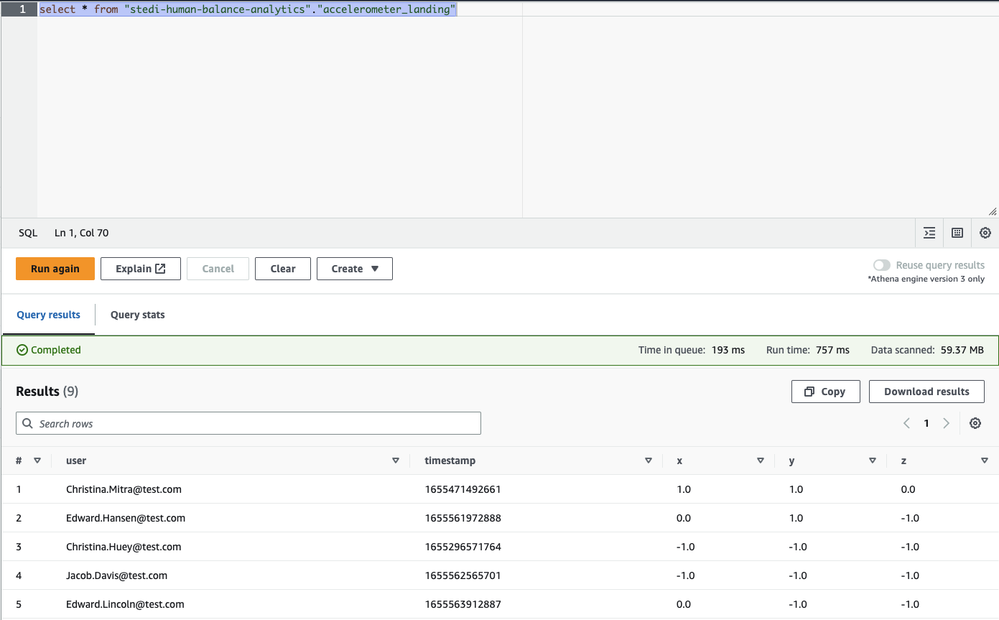
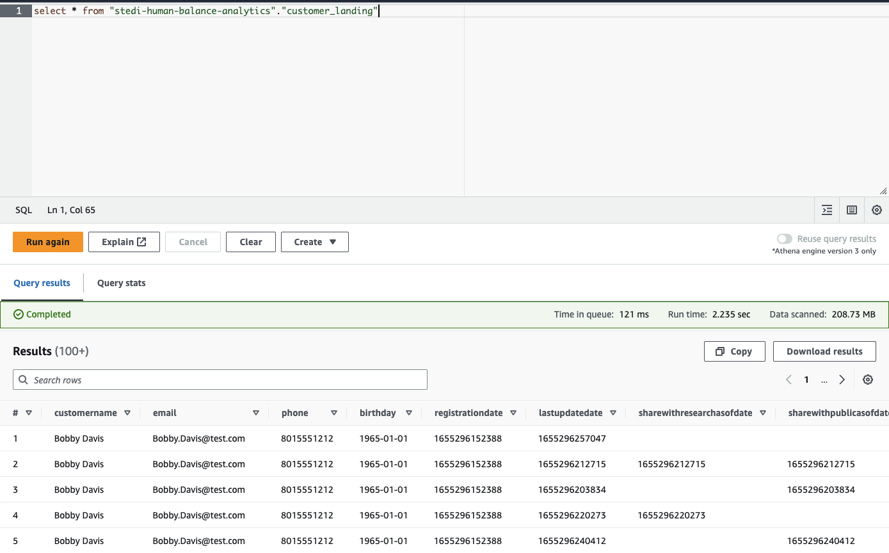
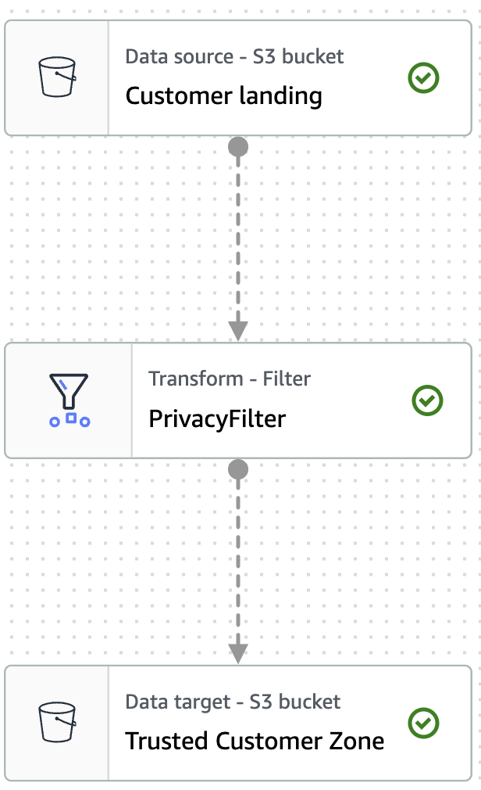
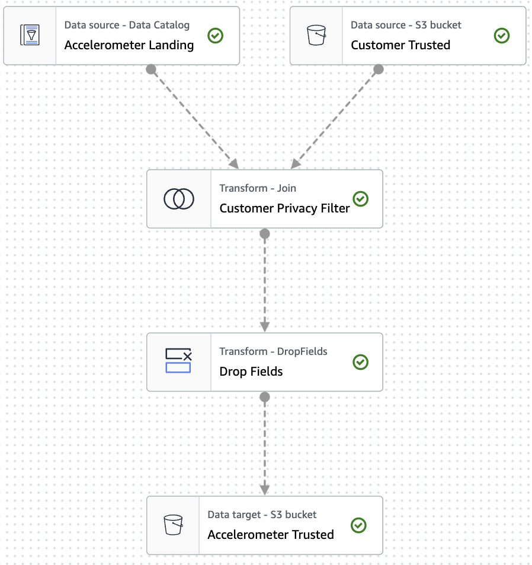
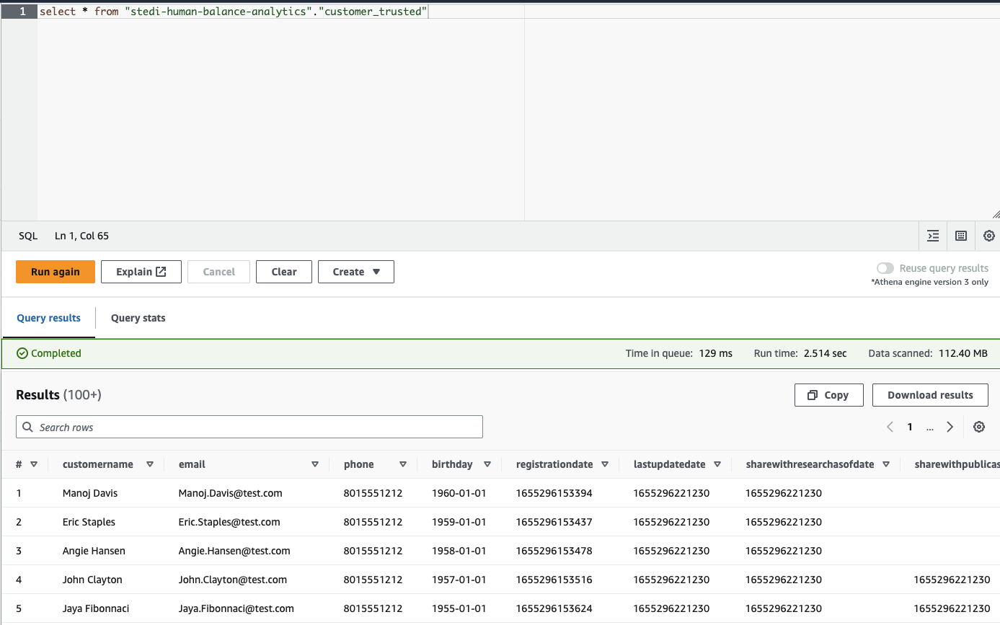

# Introduction and brief
In this project, we'll build a data lakehouse solution for sensor data that trains a machine learning model.

We are working for a company that has developed a STEDI step trainer that 

- trains the user to do a STEDI balance exercise;
- has sensors on the device that collect data to train a machine-learning algorithm to detect steps;
- has a companion mobile app that collects customer data and interacts with the device sensors.

STEDI has heard from millions of early adopters who are willing to purchase the STEDI Step Trainers and use them.

Several customers have already received their Step Trainers, installed the mobile application, and begun using them together to test their balance. The Step Trainer is just a motion sensor that records the distance of the object detected. The app uses a mobile phone accelerometer to detect motion in the X, Y, and Z directions.

The STEDI team wants to use the motion sensor data to train a machine learning model to detect steps accurately in real-time. Privacy will be a primary consideration in deciding what data can be used.

Some of the early adopters have agreed to share their data for research purposes. Only these customers’ Step Trainer and accelerometer data should be used in the training data for the machine learning model.

Our job is to extract the raw data and curate them into a data lakehouse on AWS so that data scientists can train a machine learning model. We'll use S3, Athena, and Glue. 

# Set up 
We first need to create S3 directories for our raw data. These will be called

* `customer_landing`
* `step_trainer_landing`
* `accelerometer_landing`

We'll create an S3 bucket called `stedi-human-balance-analytics-mw`. The raw source data, all in JSON format, is in `data/` in this repo. 

We have a little shell script, `s3-sync-all.sh`, which will put all of this data in our folders with a single command. We'll `export` our temporary credentials and run the shell script like `./data/s3-sync-all.sh`. [1]

# Inspecting the data
With the data in S3, we'll have an initial look at it. We'll create two Glue Tables: `customer_landing` and `accelerometer_landing` in a database called `stedi-human-balance-analytics`. We'll point Glue at the S3 folders we've created, e.g. `customer/landing/`, and define the schema. 

In raw format, one record of the customer data looks like this:

```
{
    "customerName": "Frank Doshi",
    "email": "Frank.Doshi@test.com",
    "phone": "8015551212",
    "birthDay": "1965-01-01",
    "serialNumber": "159a908a-371e-40c1-ba92-dcdea483a6a2",
    "registrationDate": 1655293787680,
    "lastUpdateDate": 1655293823654,
    "shareWithResearchAsOfDate": 1655293823654,
    "shareWithPublicAsOfDate": 1655293823654
}
```

Once that's done, we have an `accelerometer_landing` and a `customer_landing` table defined in Glue! 

We can now head over to Athena and inspect our data. For example, if we run

`select * from "stedi-human-balance-analytics"."accelerometer_landing"`

we get the below:



And doing a simple `select * ` on our `customer_landing` table:



# Creating a trusted zone with Glue
These two tables can be joined: the customer data contains information about customers, and the accelerometer data contains information about their use of the accelerometer. It'd be informative to join this data and analyse it. 

Before we can do that, we need to sanitise both datasets to ensure it only contains data from customers who agreed to share their data for research purposes. The cleaned tables will go into our Trusted zone. 

To do this, we'll write two Glue jobs. We'll go to Glue Studio and create a new job. 

The job will read data from the S3 bucket, filter out rows where ShareWithResearchAsOfDate is blank, and then load it into another S3 folder, this time, `trusted/`. The job will look as below:



We'll also create a job for the accelerometer data. Here we also need to join on the customer data in order to know which records the customer agreed to share. We then drop the customer-specific fields and we have a clean accelerometer table at the end! 

This job looks as follows:



We'll run both jobs. Once they are complete, we'll create a Glue table for our `customer_trusted` data and inspect it with Athena. 

We'll run `select * from "customer_trusted"`, which returns the below:



As we can see, the `sharewithresearchasofdate` is always populated, meaning these customers have all consented to their data being used for research. 

# Addressing data quality issues
We've found a data quality issue! The same 30 serial numbers for STEDI step trainers have been used over and over again instead of being unique. 

To fix this, we'll need another Glue job, which will sanitise our `customer_trusted` data. It should only include customers who have agreed to share their data *and* who have accelerometer data.

We can re-use the job we wrote to get the `accelerometer_trusted` data, which already contains data only about customers who have agreed to share data and who have accelerometer data. 

We'll clone the job we wrote to get the trusted accelerometer data. Instead of dropping the customer-specific data, now we'll drop the accelerometer-specific data. Finally, we'll load this data into a `customer/curated/` folder.

# Step trainer data 
We also want to load step trainer data. This data does have the correct serial numbers, so we want to make it available. We'll create a new Glue table called `step_trainer_trusted` which has step trainer records for all customers in the `customers_curated` table. 

We'll create another Glue job that will read in data from `step_trainer/landing/` in S3 and `customer/curated/`, join them on the serialnumber field, and output them in `step_trainer/trusted/`. 

This will give a step trainer dataset containing only data of customers who have agreed to share their data.

# Curated data for ML model
Finally, we'll want to make a curated table for training an ML model. This table will have each of the step trainer readings for customers who have agreed to share their data (which is in `step_trainer/trusted/`). This table will only contain step trainer and accelerometer data in it, so we'll omit the customer fields.

# Footnotes 
[1] There is about 200 MB of data, which is normally far too much to keep in a git repository, but for the purpose of this being a self-contained project, I'll put the data in here.